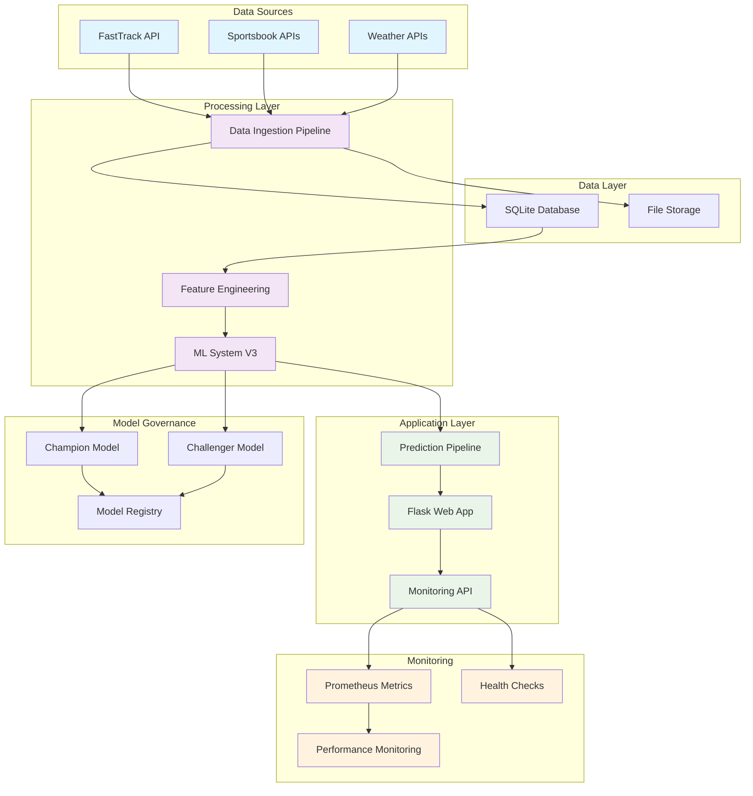

# Architecture Diagram

The following diagram illustrates the system architecture:

## Component Descriptions

### Data Sources
- **FastTrack API**: Primary source for race data and form guides
- **Sportsbook APIs**: Real-time odds and betting information
- **Weather APIs**: Weather conditions for race venues

### Data Layer
- **SQLite Database**: Stores structured race data, predictions, and metrics
- **File Storage**: Raw data files and model artifacts

### Processing Layer
- **Data Ingestion Pipeline**: Processes and validates incoming data
- **Feature Engineering**: Creates ML features from raw data
- **ML System V3**: Core machine learning system with multiple models

### Application Layer
- **Flask Web App**: Main web interface and API
- **Monitoring API**: System health and metrics endpoints
- **Prediction Pipeline**: Orchestrates prediction generation

### Model Governance
- **Champion Model**: Current production model
- **Challenger Model**: Model under evaluation
- **Model Registry**: Manages model versions and metadata

### Monitoring
- **Prometheus Metrics**: System and application metrics
- **Health Checks**: Service availability monitoring
- **Performance Monitoring**: Real-time performance tracking
