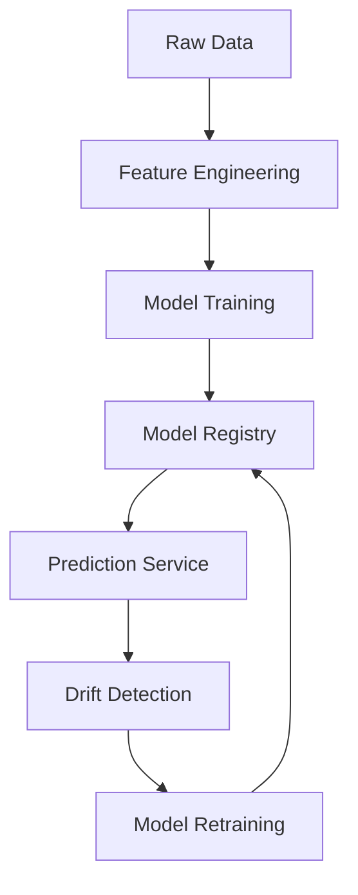

# ML Pipeline

The Machine Learning pipeline implements a comprehensive system for greyhound racing predictions with multiple stages:

## 1. Feature Engineering

The ML pipeline utilizes a versioned feature engineering system with multiple feature groups:

- **V3DistanceStatsFeatures**: Distance-based performance statistics and trends
- **V3RecentFormFeatures**: Recent performance and form analysis
- **V3VenueAnalysisFeatures**: Venue-specific performance patterns
- **V3BoxPositionFeatures**: Box position and starting advantages
- **V3CompetitionFeatures**: Competition level and field analysis
- **V3WeatherTrackFeatures**: Weather and track condition effects
- **V3TrainerFeatures**: Trainer and ownership effects

## 2. Model Training

### ML System V3
The `MLSystemV3` provides advanced model training with:
- **Bayesian Optimization**: Using Optuna for hyperparameter tuning
- **Time Series Cross-Validation**: Stratified TimeSeriesSplit for temporal data
- **Class Imbalance Handling**: SMOTE-NC and focal loss implementation
- **Probability Calibration**: Platt calibration for reliable prediction probabilities
- **MLflow Integration**: Model versioning and experiment tracking

### Champion/Challenger System
- **Model Governance**: Automatic promotion of better-performing models
- **A/B Testing**: Champion vs challenger model comparison
- **Rollback Capability**: Automatic fallback to champion model if performance degrades
- **Performance Thresholds**: ROC AUC-based promotion criteria

## 3. Prediction Systems

### Strategy Pattern Implementation
Multiple prediction strategies with fallback hierarchy:

1. **PredictionPipelineV3**: Latest ML system with advanced features
2. **ComprehensivePredictionPipeline**: Comprehensive analysis pipeline
3. **UnifiedPredictor**: Unified interface with intelligent fallbacks
4. **WeatherEnhancedPredictor**: Weather-enhanced predictions

### Real-time Predictions
- **Streaming Predictions**: Server-Sent Events (SSE) for real-time updates
- **Parallel Processing**: Concurrent prediction execution
- **Caching**: Intelligent caching for improved performance

## 4. Model Registry

Centralized model management system:
- **Version Control**: Semantic versioning for models
- **Model Metadata**: Performance metrics, training parameters
- **Artifact Storage**: Model files and configuration storage
- **Performance Tracking**: Historical performance monitoring

## 5. Drift Detection

Automated monitoring for model performance degradation:
- **Feature Drift**: Kolmogorov-Smirnov tests for feature distribution changes
- **Performance Drift**: Accuracy monitoring with configurable thresholds
- **API Integration**: Real-time drift reporting via `/api/check_performance_drift`

## Architecture Flow

This pipeline ensures robust, maintainable, and high-performance machine learning operations for greyhound racing predictions.
