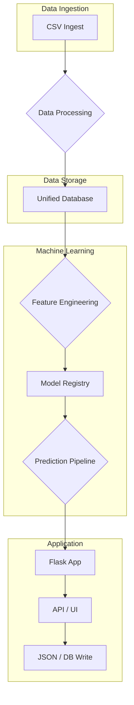

# Greyhound Analysis Predictor - Architecture Map

This document provides a high-level overview of the Greyhound Analysis Predictor application architecture.

## Data Flow Diagram

The following Mermaid diagram illustrates the primary data flow, from data ingestion to prediction and output.

## Core Components

*   **Flask Application (`app.py`):** The main web application, which handles user requests, serves the UI, and provides API endpoints.
*   **Prediction Pipelines:**
    *   **`prediction_pipeline_v3.py` (Primary):** The main entry point for making predictions. It uses a fallback system to ensure a prediction is always returned.
    *   **`ml_system_v3.py`:** A complete machine learning system that can be trained and used for predictions.
    *   **`unified_predictor.py`:**  An earlier attempt to unify various prediction models.
*   **Model Registry (`model_registry.py`):**  Manages trained machine learning models, allowing for versioning and easy retrieval of the best-performing models.
*   **Database (`create_unified_database.py`):**  A unified SQLite database that stores all race data, dog information, and predictions.

## Obsolete and Archived Files

The codebase contains a significant number of files in the following directories:

*   `archive/`
*   `archive_unused_scripts/`
*   `outdated_scripts/`

These files should be reviewed and either deleted or moved to a separate, dedicated archive to reduce clutter in the main repository.

## Next Steps

The next step is to perform a deep-dive into the database to validate the schema and data integrity.

