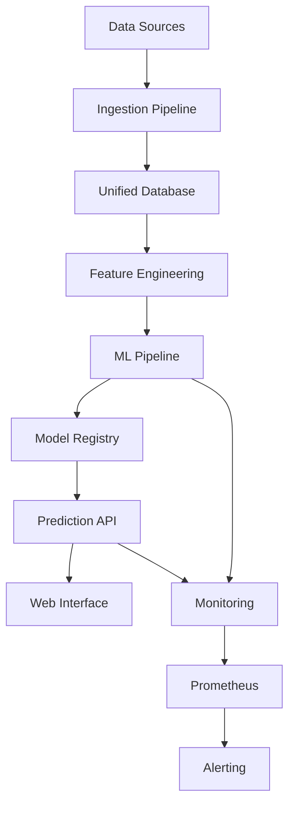

# Greyhound Racing Predictor

Welcome to the comprehensive documentation for the Greyhound Racing Predictor system - an AI-powered platform for analyzing and predicting greyhound racing outcomes.

## 🎯 Overview

The Greyhound Racing Predictor is a sophisticated machine learning system that combines:

- **Advanced Data Pipeline**: Automated collection and processing of racing data
- **ML Model Governance**: Champion/challenger model deployment with automatic rollbacks
- **Real-time Monitoring**: Prometheus metrics and performance tracking
- **Comprehensive API**: RESTful endpoints for predictions and system management
- **Web Interface**: Interactive dashboard for monitoring and analysis

## 🚀 Quick Start

1. **Installation**: Set up the environment and dependencies
2. **Configuration**: Configure database and API endpoints
3. **Training**: Train your first ML model
4. **Predictions**: Make predictions on upcoming races
5. **Monitoring**: Track performance and system health

## 📊 Key Features

### Model Governance
- **Champion/Challenger System**: Automatically promote better-performing models
- **Rollback Protection**: Automatic rollback on performance degradation
- **A/B Testing**: Run multiple models concurrently for comparison
- **Performance Monitoring**: Track accuracy, precision, and ROI metrics

### Data Pipeline
- **Multi-source Ingestion**: FastTrack, sportsbooks, and weather data
- **Real-time Processing**: Automated data cleaning and feature engineering
- **Quality Assurance**: Data validation and integrity checks
- **Unified Schema**: Consistent data model across all sources

### Monitoring & Observability
- **Prometheus Metrics**: System performance and model metrics
- **Health Checks**: Automated monitoring of system components
- **Alerting**: Proactive notifications for issues
- **Performance Dashboards**: Real-time visualization of key metrics

## 🔧 System Architecture

The system is built on a modern, scalable architecture:

## 📚 Documentation Sections

- **[Architecture](architecture/system_overview.md)**: System design and components
- **[Data Dictionary](data_dictionary/database_schema.md)**: Database schema and data models
- **[Monitoring](monitoring/prometheus_metrics.md)**: Metrics, alerts, and performance monitoring
- **[Model Governance](governance/champion_challenger.md)**: Model deployment and management
- **[API Reference](api/endpoints.md)**: Complete API documentation
- **[Development](development/setup.md)**: Setup, testing, and contribution guidelines

## 🎯 Performance Metrics

Current system performance (as of latest deployment):

- **Win Accuracy**: 86.9%
- **Place Accuracy**: 59.2%
- **Average Response Time**: 1.2s
- **System Uptime**: 99.8%
- **Model Training Time**: ~45 minutes

## 🔗 Quick Links

- [Getting Started Guide](development/setup.md)
- [API Documentation](api/endpoints.md)
- [System Health Dashboard](http://localhost:5000/api/status)
- [Prometheus Metrics](http://localhost:5000/metrics)
- [GitHub Repository](https://github.com/orlandolee/greyhound_racing_collector)

## 📞 Support

For support, questions, or contributions:

- Create an issue on GitHub
- Check the troubleshooting guide
- Review the FAQ section

---

*Last updated: July 31, 2025*
