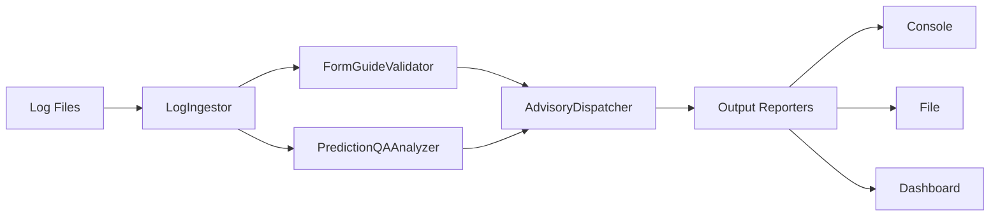
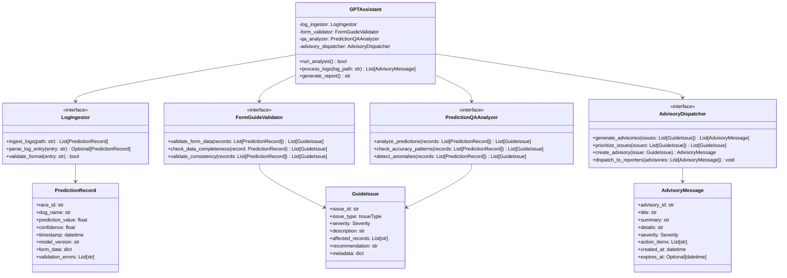

# GPTAssistant High-Level Architecture & Interfaces

## System Overview

The GPTAssistant system follows a pipeline architecture: **Log Parser → Analyzers → Advisory Generator → Output Reporters**

## Class Diagram

## Component Interfaces

### 1. LogIngestor Interface

**Purpose**: Parse and ingest prediction logs from various sources

**Key Methods**:
- `ingest_logs(path: str) -> List[PredictionRecord]`
- `parse_log_entry(entry: str) -> Optional[PredictionRecord]`
- `validate_format(entry: str) -> bool`

**Responsibilities**:
- Read log files from specified paths
- Parse individual log entries into structured data
- Validate log format and structure
- Handle multiple log formats (JSON, CSV, text)

### 2. FormGuideValidator Interface

**Purpose**: Validate form guide data completeness and consistency

**Key Methods**:
- `validate_form_data(records: List[PredictionRecord]) -> List[GuideIssue]`
- `check_data_completeness(record: PredictionRecord) -> List[GuideIssue]`
- `validate_consistency(records: List[PredictionRecord]) -> List[GuideIssue]`

**Responsibilities**:
- Check for missing or incomplete form data
- Validate data consistency across records
- Identify data quality issues
- Flag potentially incorrect form information

### 3. PredictionQAAnalyzer Interface

**Purpose**: Analyze prediction quality and identify performance issues

**Key Methods**:
- `analyze_predictions(records: List[PredictionRecord]) -> List[GuideIssue]`
- `check_accuracy_patterns(records: List[PredictionRecord]) -> List[GuideIssue]`
- `detect_anomalies(records: List[PredictionRecord]) -> List[GuideIssue]`

**Responsibilities**:
- Analyze prediction accuracy patterns
- Detect statistical anomalies in predictions
- Identify model performance degradation
- Flag potentially biased or incorrect predictions

### 4. AdvisoryDispatcher Interface

**Purpose**: Generate and dispatch advisory messages based on identified issues

**Key Methods**:
- `generate_advisories(issues: List[GuideIssue]) -> List[AdvisoryMessage]`
- `prioritize_issues(issues: List[GuideIssue]) -> List[GuideIssue]`
- `create_advisory(issue: GuideIssue) -> AdvisoryMessage`
- `dispatch_to_reporters(advisories: List[AdvisoryMessage]) -> void`

**Responsibilities**:
- Transform issues into actionable advisories
- Prioritize issues by severity and impact
- Generate clear, actionable recommendations
- Coordinate with output reporters

## Data Flow Architecture

1. **Ingestion Stage**: LogIngestor reads and parses log files into PredictionRecord objects
2. **Analysis Stage**: FormGuideValidator and PredictionQAAnalyzer process records in parallel
3. **Advisory Generation**: AdvisoryDispatcher consolidates issues into advisory messages
4. **Output Stage**: Reporters format and deliver advisories to various outputs

## Error Handling Strategy

- **Graceful Degradation**: System continues operation even if individual components fail
- **Validation Pipeline**: Each stage validates inputs before processing
- **Error Propagation**: Critical errors bubble up with context
- **Recovery Mechanisms**: Built-in retry logic for transient failures

## Extensibility Points

- **Plugin Architecture**: New analyzers can be added without core changes
- **Output Formats**: Multiple reporter implementations for different output needs
- **Custom Validators**: Domain-specific validation rules can be plugged in
- **Configurable Thresholds**: Severity and priority thresholds are configurable
